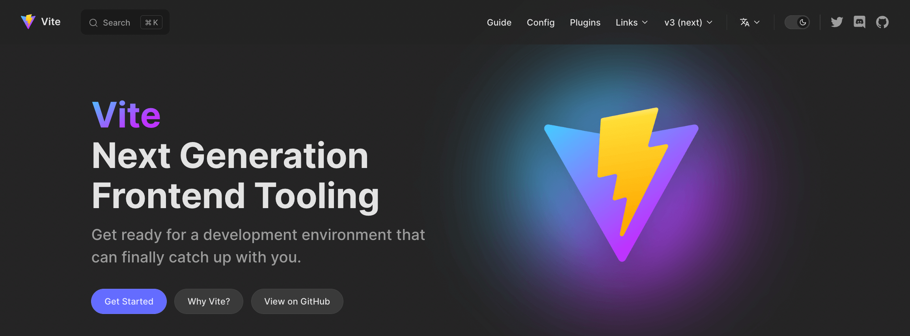
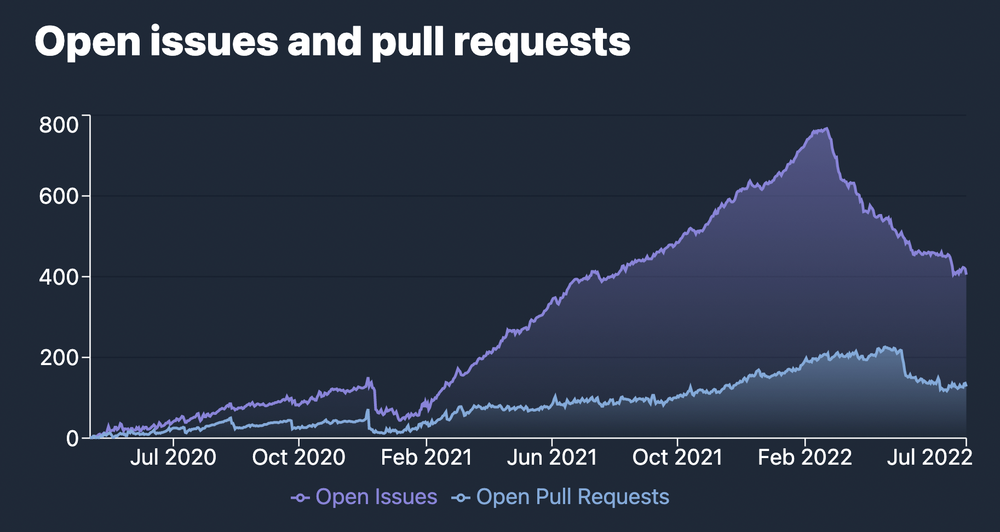

# Vite 3.0 вийшов!

_23 липня 2022_ - Ознайомтеся з [анонсом Vite 4.0](./announcing-vite4.md)

У лютому минулого року [Еван Ю](https://twitter.com/youyuxi) випустив Vite 2. З того часу його популярність неухильно зростала, досягнувши понад 1 мільйон завантажень npm на тиждень. Після випуску швидко сформувалася велика екосистема. Vite стимулює нову хвилю інновацій у веб-фреймворках. [Nuxt 3](https://v3.nuxtjs.org/) використовує Vite за замовчуванням. [SvelteKit](https://kit.svelte.dev/), [Astro](https://astro.build/), [Hydrogen](https://hydrogen.shopify.dev/) та [SolidStart](https://docs.solidjs.com/quick-start) побудовані на Vite. [Laravel тепер використовує Vite за замовчуванням](https://laravel.com/docs/9.x/vite). [Vite Ruby](https://vite-ruby.netlify.app/) демонструє, як Vite може покращити DX у Rails. [Vitest](https://vitest.dev) робить значні кроки як альтернатива Jest, створена на основі Vite. Vite стоїть за новими функціями тестування компонентів у [Cypress](https://docs.cypress.io/guides/component-testing/writing-your-first-component-test) та [Playwright](https://playwright.dev/docs/test-components), Storybook має [Vite як офіційний збирач](https://github.com/storybookjs/builder-vite). І [список продовжується](https://patak.dev/vite/ecosystem.html). Підтримувачі більшості цих проектів долучилися до покращення ядра Vite, тісно співпрацюючи з [командою Vite](https://vite.dev/team) та іншими учасниками.


Сьогодні, через 16 місяців після запуску v2, ми раді оголосити про випуск Vite 3. Ми вирішили випускати нову основну версію Vite щонайменше раз на рік, щоб узгодити її з [EOL Node.js](https://nodejs.org/en/about/releases/) і скористатися можливістю регулярно переглядати API Vite з коротким шляхом міграції для проектів в екосистемі.

Швидкі посилання:

- [Документація](/)
- [Посібник з міграції](https://v3.vite.dev/guide/migration.html)
- [Список змін](https://github.com/vitejs/vite/blob/main/packages/vite/CHANGELOG.md#300-2022-07-13)

Якщо ви новачок у Vite, рекомендуємо прочитати [Посібник "Чому Vite"](https://vite.dev/guide/why.html). Потім ознайомтеся з [Посібником з початку роботи](https://vite.dev/guide/) та [Посібником з функцій](https://vite.dev/guide/features), щоб дізнатися, що Vite пропонує з коробки. Як завжди, внески вітаються на [GitHub](https://github.com/vitejs/vite). Понад [600 співробітників](https://github.com/vitejs/vite/graphs/contributors) допомогли покращити Vite до цього часу. Слідкуйте за оновленнями на [Twitter](https://twitter.com/vite_js) або приєднуйтесь до обговорень з іншими користувачами Vite на нашому [сервері Discord](http://chat.vite.dev).

## Нова документація

Перейдіть на [vite.dev](https://vite.dev), щоб насолодитися новою документацією v3. Vite тепер використовує нову тему за замовчуванням [VitePress](https://vitepress.vuejs.org), з приголомшливим темним режимом та іншими функціями.

[](https://vite.dev)

Кілька проектів в екосистемі вже перейшли на неї (див. [Vitest](https://vitest.dev), [vite-plugin-pwa](https://vite-plugin-pwa.netlify.app/) та [VitePress](https://vitepress.vuejs.org/) самі).

Якщо вам потрібно отримати доступ до документації Vite 2, вона залишатиметься онлайн на [v2.vite.dev](https://v2.vite.dev). Також є новий піддомен [main.vite.dev](https://main.vite.dev), де кожен коміт до основної гілки Vite автоматично розгортається. Це корисно при тестуванні бета-версій або внесенні змін до ядра.

Також тепер є офіційний іспанський переклад, який було додано до попередніх китайських та японських перекладів:

- [简体中文](https://cn.vite.dev/)
- [日本語](https://ja.vite.dev/)
- [Español](https://es.vite.dev/)

## Стартові шаблони Create Vite

Шаблони [create-vite](/guide/#trying-vite-online) були чудовим інструментом для швидкого тестування Vite з вашим улюбленим фреймворком. У Vite 3 всі шаблони отримали нову тему, що відповідає новій документації. Відкрийте їх онлайн і почніть грати з Vite 3 зараз:

<div class="stackblitz-links">
<a target="_blank" href="https://vite.new"></a>
<a target="_blank" href="https://vite.new/vue"></a>
<a target="_blank" href="https://vite.new/svelte"></a>
<a target="_blank" href="https://vite.new/react"></a>
<a target="_blank" href="https://vite.new/preact"></a>
<a target="_blank" href="https://vite.new/lit"></a>
</div>

<style>
.stackblitz-links {
  display: flex;
  width: 100%;
  justify-content: space-around;
  align-items: center;
}
@media screen and (max-width: 550px) {
  .stackblitz-links {
    display: grid;
    grid-template-columns: 1fr 1fr 1fr;
    width: 100%;
    gap: 2rem;
    padding-left: 3rem;
    padding-right: 3rem;
  }
}
.stackblitz-links > a {
  width: 70px;
  height: 70px;
  display: grid;
  align-items: center;
  justify-items: center;
}
.stackblitz-links > a:hover {
  filter: drop-shadow(0 0 0.5em #646cffaa);
}
</style>

Тема тепер спільна для всіх шаблонів. Це повинно допомогти краще передати обсяг цих стартових шаблонів як мінімальних шаблонів для початку роботи з Vite. Для більш повних рішень, включаючи налаштування лінтингу, тестування та інші функції, існують офіційні шаблони на основі Vite для деяких фреймворків, таких як [create-vue](https://github.com/vuejs/create-vue) та [create-svelte](https://github.com/sveltejs/kit). Існує список шаблонів, що підтримується спільнотою, на [Awesome Vite](https://github.com/vitejs/awesome-vite#templates).

## Покращення для розробників

### Vite CLI

<pre style="background-color: var(--vp-code-block-bg);padding:2em;border-radius:8px;max-width:100%;overflow-x:auto;">
  <span style="color:lightgreen"><b>VITE</b></span> <span style="color:lightgreen">v3.0.0</span>  <span style="color:gray">готовий за <b>320</b> мс</span>

  <span style="color:lightgreen"><b>➜</b></span>  <span style="color:white"><b>Локально</b>:</span>   <span style="color:cyan">http://127.0.0.1:5173/</span>
  <span style="color:green"><b>➜</b></span>  <span style="color:gray"><b>Мережа</b>: використовуйте --host для доступу</span>
</pre>

Окрім естетичних покращень CLI, ви помітите, що порт сервера розробки за замовчуванням тепер 5173, а сервер попереднього перегляду слухає на 4173. Ця зміна забезпечує уникнення конфліктів з іншими інструментами.

### Покращена стратегія підключення WebSocket

Однією з проблем Vite 2 було налаштування сервера при роботі за проксі. Vite 3 змінює схему підключення за замовчуванням, щоб вона працювала з коробки в більшості сценаріїв. Всі ці налаштування тепер тестуються як частина Vite Ecosystem CI через [`vite-setup-catalogue`](https://github.com/sapphi-red/vite-setup-catalogue).

### Покращення холодного старту

Vite тепер уникає повного перезавантаження під час холодного старту, коли імпорти додаються плагінами під час сканування початкових статично імпортованих модулів ([#8869](https://github.com/vitejs/vite/issues/8869)).

<details>
  <summary><b>Натисніть, щоб дізнатися більше</b></summary>

У Vite 2.9 як сканер, так і оптимізатор працювали у фоновому режимі. У найкращому сценарії, коли сканер знаходив усі залежності, перезавантаження не було потрібно під час холодного старту. Але якщо сканер пропускав залежність, потрібна була нова фаза оптимізації, а потім перезавантаження. Vite зміг уникнути деяких з цих перезавантажень у v2.9, оскільки ми виявляли, чи нові оптимізовані фрагменти сумісні з тими, що були у браузері. Але якщо була загальна залежність, підфрагменти могли змінитися, і перезавантаження було необхідним, щоб уникнути дублювання стану. У Vite 3 оптимізовані залежності не передаються браузеру, поки не завершиться сканування статичних імпортів. Швидка фаза оптимізації запускається, якщо є відсутня залежність (наприклад, додана плагіном), і тільки тоді передаються зібрані залежності. Таким чином, перезавантаження сторінки більше не потрібне для цих випадків.

</details>


### import.meta.glob

Підтримка `import.meta.glob` була переписана. Прочитайте про нові функції у [Посібнику з імпорту Glob](/guide/features.html#glob-import):

[Кілька шаблонів](/guide/features.html#multiple-patterns) можуть бути передані як масив

```js
import.meta.glob(['./dir/*.js', './another/*.js'])
```

[Негативні шаблони](/guide/features.html#negative-patterns) тепер підтримуються (з префіксом `!`) для ігнорування деяких конкретних файлів

```js
import.meta.glob(['./dir/*.js', '!**/bar.js'])
```

[Іменовані імпорти](/guide/features.html#named-imports) можуть бути вказані для покращення tree-shaking

```js
import.meta.glob('./dir/*.js', { import: 'setup' })
```

[Користувацькі запити](/guide/features.html#custom-queries) можуть бути передані для додавання метаданих

```js
import.meta.glob('./dir/*.js', { query: { custom: 'data' } })
```

[Імпорти з нетерпінням](/guide/features.html#glob-import) тепер передаються як прапор

```js
import.meta.glob('./dir/*.js', { eager: true })
```

### Узгодження імпорту WASM з майбутніми стандартами

API імпорту WebAssembly було переглянуто, щоб уникнути конфліктів з майбутніми стандартами та зробити його більш гнучким:

```js
import init from './example.wasm?init'

init().then((instance) => {
  instance.exports.test()
})
```

Дізнайтеся більше у [посібнику з WebAssembly](/guide/features.html#webassembly)

## Покращення збірки

### ESM SSR збірка за замовчуванням

Більшість SSR фреймворків в екосистемі вже використовували збірки ESM. Тому Vite 3 робить ESM форматом за замовчуванням для SSR збірок. Це дозволяє нам спростити попередні [евристики зовнішніх SSR](https://vite.dev/guide/ssr.html#ssr-externals), зовнішні залежності за замовчуванням.

### Покращена підтримка відносної бази

Vite 3 тепер правильно підтримує відносну базу (використовуючи `base: ''`), дозволяючи зібраним ресурсам розгортатися на різних базах без повторної збірки. Це корисно, коли база невідома під час збірки, наприклад, при розгортанні на мережах з адресами вмісту, таких як [IPFS](https://ipfs.io/).

## Експериментальні функції

### Тонке управління шляхами зібраних ресурсів (експериментально)

Існують інші сценарії розгортання, де цього недостатньо. Наприклад, якщо згенеровані хешовані ресурси потрібно розгорнути на іншому CDN від публічних файлів, тоді потрібен більш тонкий контроль над генерацією шляхів під час збірки. Vite 3 надає експериментальний API для зміни шляхів зібраних файлів. Перевірте [Розширені параметри бази збірки](/guide/build.html#advanced-base-options) для отримання додаткової інформації.

### Оптимізація залежностей за допомогою Esbuild під час збірки (експериментально)

Однією з основних відмінностей між часом розробки та часом збірки є те, як Vite обробляє залежності. Під час збірки використовується [`@rollup/plugin-commonjs`](https://github.com/rollup/plugins/tree/master/packages/commonjs), щоб дозволити імпорт лише CJS-залежностей (наприклад, React). Під час використання сервера розробки замість цього використовується esbuild для попереднього пакетування та оптимізації залежностей, і схема внутрішньої взаємодії застосовується під час перетворення коду користувача, що імпортує CJS-залежності. Під час розробки Vite 3 ми внесли зміни, необхідні для того, щоб також дозволити використання [esbuild для оптимізації залежностей під час збірки](https://v3.vite.dev/guide/migration.html#using-esbuild-deps-optimization-at-build-time). [`@rollup/plugin-commonjs`](https://github.com/rollup/plugins/tree/master/packages/commonjs) тоді можна уникнути, зробивши час розробки та збірки однаковим.

Оскільки Rollup v3 буде випущено в найближчі місяці, і ми плануємо випустити ще одну основну версію Vite, ми вирішили зробити цей режим опціональним, щоб зменшити обсяг v3 і дати Vite та екосистемі більше часу для вирішення можливих проблем з новим підходом CJS-взаємодії під час збірки. Фреймворки можуть перейти на використання оптимізації залежностей esbuild під час збірки за замовчуванням у своєму власному темпі до Vite 4.

### Часткове прийняття HMR (експериментально)

Існує підтримка за вибором для [часткового прийняття HMR](https://github.com/vitejs/vite/pull/7324). Ця функція може розблокувати більш детальну HMR для компонентів фреймворку, які експортують кілька прив'язок в одному модулі. Ви можете дізнатися більше на [обговоренні цієї пропозиції](https://github.com/vitejs/vite/discussions/7309).

## Зменшення розміру пакету

Vite піклується про свій розмір публікації та встановлення; швидке встановлення нового додатка є функцією. Vite об'єднує більшість своїх залежностей і намагається використовувати сучасні легкі альтернативи, де це можливо. Продовжуючи цю постійну мету, розмір публікації Vite 3 на 30% менший, ніж у v2.

|             | Розмір публікації | Розмір встановлення |
| ----------- | :---------------: | :-----------------: |
| Vite 2.9.14 |      4.38MB       |       19.1MB        |
| Vite 3.0.0  |      3.05MB       |       17.8MB        |
| Зменшення   |       -30%        |        -7%          |

Частково це зменшення стало можливим завдяки тому, що деякі залежності, які більшість користувачів не потребували, стали опціональними. По-перше, [Terser](https://github.com/terser/terser) більше не встановлюється за замовчуванням. Ця залежність більше не була потрібна, оскільки ми вже зробили esbuild стандартним мінімізатором як для JS, так і для CSS у Vite 2. Якщо ви використовуєте `build.minify: 'terser'`, вам потрібно буде встановити його (`npm add -D terser`). Ми також перемістили [node-forge](https://github.com/digitalbazaar/forge) з монорепозиторію, реалізувавши підтримку автоматичної генерації https-сертифікатів як новий плагін: [`@vitejs/plugin-basic-ssl`](https://v3.vite.dev/guide/migration.html#automatic-https-certificate-generation). Оскільки ця функція створює лише недовірені сертифікати, які не додаються до локального сховища, вона не виправдовувала додатковий розмір.

## Виправлення помилок

Марафон тріажу був очолений [@bluwyoo](https://twitter.com/bluwyoo), [@sapphi_red](https://twitter.com/sapphi_red), які нещодавно приєдналися до команди Vite. За останні три місяці кількість відкритих питань Vite зменшилася з 770 до 400. І це зниження було досягнуто, коли кількість нових відкритих PR була на рекордно високому рівні. У той же час, [@haoqunjiang](https://twitter.com/haoqunjiang) також підготував всебічний [огляд питань Vite](https://github.com/vitejs/vite/discussions/8232).

[](https://www.repotrends.com/vitejs/vite)

[](https://www.repotrends.com/vitejs/vite)

## Примітки щодо сумісності

- Vite більше не підтримує Node.js 12 / 13 / 15, які досягли свого EOL. Тепер потрібен Node.js 14.18+ / 16+.
- Vite тепер публікується як ESM, з проксі CJS до входу ESM для сумісності.
- Сучасний базовий рівень браузера тепер орієнтований на браузери, які підтримують [нативні ES-модулі](https://caniuse.com/es6-module), [нативний динамічний імпорт ESM](https://caniuse.com/es6-module-dynamic-import) та [`import.meta`](https://caniuse.com/mdn-javascript_operators_import_meta).
- Розширення файлів JS у режимі SSR та бібліотеки тепер використовують дійсне розширення (`js`, `mjs` або `cjs`) для вихідних JS-записів та фрагментів на основі їх формату та типу пакету.

Дізнайтеся більше у [Посібнику з міграції](https://v3.vite.dev/guide/migration.html).

## Оновлення ядра Vite

Працюючи над Vite 3, ми також покращили досвід співпраці для співробітників [ядра Vite](https://github.com/vitejs/vite).

- Юніт-тести та E2E-тести були перенесені на [Vitest](https://vitest.dev), що забезпечує швидший та стабільніший DX. Цей крок також працює як тестування для важливого інфраструктурного проекту в екосистемі.
- Збірка VitePress тепер тестується як частина CI.
- Vite оновлено до [pnpm 7](https://pnpm.io/), слідуючи за рештою екосистеми.
- Ігрові майданчики були перенесені до [`/playgrounds`](https://github.com/vitejs/vite/tree/main/playground) з каталогу пакетів.
- Пакети та ігрові майданчики тепер мають `"type": "module"`.
- Плагіни тепер об'єднуються за допомогою [unbuild](https://github.com/unjs/unbuild), а [plugin-vue-jsx](https://github.com/vitejs/vite-plugin-vue/tree/main/packages/plugin-vue-jsx) та [plugin-legacy](https://github.com/vitejs/vite/tree/main/packages/plugin-legacy) були перенесені на TypeScript.

## Екосистема готова до v3

Ми тісно співпрацювали з проектами в екосистемі, щоб забезпечити готовність фреймворків, що працюють на Vite, до Vite 3. [vite-ecosystem-ci](https://github.com/vitejs/vite-ecosystem-ci) дозволяє нам запускати CI від провідних гравців в екосистемі проти основної гілки Vite та отримувати своєчасні звіти перед введенням регресії. Сьогоднішній випуск незабаром має бути сумісним з більшістю проектів, що використовують Vite.

## Подяки

Vite 3 є результатом спільних зусиль членів [команди Vite](/team), які працювали разом з підтримувачами проектів екосистеми та іншими співробітниками над ядром Vite.

Ми хочемо подякувати всім, хто реалізував функції та виправлення, надав відгуки та був залучений до Vite 3:

- Члени команди Vite [@youyuxi](https://twitter.com/youyuxi), [@patak_dev](https://twitter.com/patak_dev), [@antfu7](https://twitter.com/antfu7), [@bluwyoo](https://twitter.com/bluwyoo), [@sapphi_red](https://twitter.com/sapphi_red), [@haoqunjiang](https://twitter.com/haoqunjiang), [@poyoho](https://github.com/poyoho), [@Shini_92](https://twitter.com/Shini_92) та [@retropragma](https://twitter.com/retropragma).
- [@benmccann](https://github.com/benmccann), [@danielcroe](https://twitter.com/danielcroe), [@brillout](https://twitter.com/brillout), [@sheremet_va](https://twitter.com/sheremet_va), [@userquin](https://twitter.com/userquin), [@enzoinnocenzi](https://twitter.com/enzoinnocenzi), [@maximomussini](https://twitter.com/maximomussini), [@IanVanSchooten](https://twitter.com/IanVanSchooten), команді [Astro](https://astro.build/) та всім іншим підтримувачам фреймворків та плагінів в екосистемі, які допомогли сформувати v3.
- [@dominikg](https://github.com/dominikg) за його роботу над vite-ecosystem-ci.
- [@ZoltanKochan](https://twitter.com/ZoltanKochan) за його роботу над [pnpm](https://pnpm.io/) та за його оперативність, коли нам потрібна була підтримка.
- [@rixo](https://github.com/rixo) за підтримку HMR Partial Accept.
- [@KiaKing85](https://twitter.com/KiaKing85) за підготовку теми до випуску Vite 3 та [@\_brc_dd](https://twitter.com/_brc_dd) за роботу над внутрішніми частинами VitePress.
- [@CodingWithCego](https://twitter.com/CodingWithCego) за новий іспанський переклад та [@ShenQingchuan](https://twitter.com/ShenQingchuan), [@hiro-lapis](https://github.com/hiro-lapis) та іншим командам китайських та японських перекладів за підтримку актуальності перекладених документів.

Ми також хочемо подякувати окремим особам та компаніям, які спонсорують команду Vite, та компаніям, які інвестують у розвиток Vite: частина роботи [@antfu7](https://twitter.com/antfu7) над Vite та екосистемою є частиною його роботи в [Nuxt Labs](https://nuxtlabs.com/), а [StackBlitz](https://stackblitz.com/) найняв [@patak_dev](https://twitter.com/patak_dev) для роботи на повний робочий день над Vite.

## Що далі

Ми витратимо наступні місяці на забезпечення плавного переходу для всіх проектів, побудованих на Vite. Тому перші мінорні версії будуть зосереджені на продовженні наших зусиль з тріажу з акцентом на нові відкриті питання.

Команда Rollup [працює над своєю наступною основною версією](https://twitter.com/lukastaegert/status/1544186847399743488), яка буде випущена в наступні місяці. Як тільки екосистема плагінів Rollup матиме час на оновлення, ми випустимо нову основну версію Vite. Це дасть нам ще одну можливість впровадити більш значні зміни цього року, які ми могли б використати для стабілізації деяких експериментальних функцій, введених у цьому випуску.

Якщо ви зацікавлені в покращенні Vite, найкращий спосіб приєднатися - допомогти з тріажем питань. Приєднуйтесь до [нашого Discord](https://chat.vite.dev) та шукайте канал `#contributing`. Або залучайтеся до наших каналів `#docs`, `#help` інших, або створюйте плагіни. Ми тільки починаємо. Є багато відкритих ідей для покращення DX Vite.
